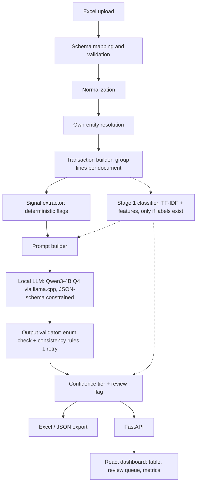
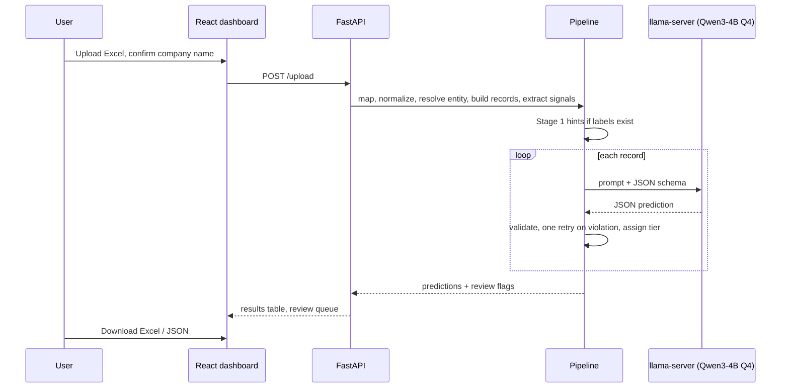

# Ledgerlens: Hybrid Voucher Classification for VYOM+

**Hacktober Fest x Elevate IIITN Open Source AI Hackathon 2026: Qualifier Submission**
**Problem Statement #4: VYOM+ Intelligent Voucher Classification Using Open-Source LLMs**

Team: `[Team Name]` | Members: `[Names]` | Contact: `[Email]`

> **Status of this document.** This is a qualifier proposal. No implementation exists in this repository and no results have been measured. Every statement about performance is written as "will be evaluated". Sections clearly separate **planned design**, **assumptions we still need to verify**, and **results** (none yet).

---

## 1. Project Name

**Ledgerlens**, a hybrid structured-data + local-LLM system that assigns one accounting voucher type to each transaction in an Excel file whose voucher-type column has been removed.

---

## 2. Problem Statement

We receive an Excel file of financial transactions. The voucher-type column is deliberately missing. For every transaction we must predict exactly one category from a fixed list of 27 (Purchase, Sales, Purchase Return / Debit Note, Sales Return / Credit Note, Payment, Receipt, Contra, Journal, Salary / Payroll, Attendance, Purchase Order, Sales Order, Receipt Note, Delivery Note, Rejection In, Rejection Out, Stock Journal, Physical Stock, Material In, Material Out, Job Work In Order, Job Work Out Order, Import, Export, Expense, Advance / Prepayment, Other / Miscellaneous).

**Why this is hard, specifically:**

1. **The label depends on perspective, not just content.** The same invoice is a *Purchase* in the buyer's books and a *Sales* in the seller's books. Nothing in the row says which company's books we are classifying. Keyword matching cannot solve this; the system has to know who "we" are.
2. **Many categories differ by one field or by direction.** Payment vs Receipt is the direction of money. Purchase Return vs Sales Return is the direction of goods plus a return indicator. Material In vs Receipt Note vs Purchase differs by whether money, a tax invoice, or only a stock movement is present.
3. **Records are often incomplete.** Parties, GST, or item descriptions can be missing or vague, so some records have no single defensible answer from the data alone.
4. **Label conventions overlap.** An import is also a purchase; an advance is also a payment; an expense can look like a purchase. The correct label depends on the convention the dataset follows (see Section 16, open questions).
5. **Output must be consistent and machine-readable.** Free-text LLM output that sometimes names a category not in the list is not usable.

We are working from the problem statement only. We have not seen VYOM+ internals or the evaluation dataset, so our design is schema-tolerant rather than tied to specific column names.

---

## 3. Project Overview

Ledgerlens reads an Excel file, normalizes it, groups rows into transaction-level records, extracts deterministic signals (e.g., "our company is the buyer", "CGST+SGST present", "negative quantity"), and sends each record plus its signals to a locally running quantized open-weight LLM. The LLM must return a JSON object whose `voucher_type` field is constrained to the 27 allowed values. A validator then checks the prediction against accounting consistency rules, and a confidence tier decides whether the record is auto-accepted or flagged for human review. Results are exported to Excel/JSON and shown in a small dashboard.

If labelled examples are available, a lightweight scikit-learn classifier provides a second opinion and a fast path (Section 4). If they are not, the pipeline runs on LLM + signals + validation only.

---

## 4. Proposed Solution

### 4.1 Does this problem actually need an LLM? Approach comparison

We compared five approaches before choosing.

| Approach | What it gets right | Where it fails on *this* problem | Verdict |
|---|---|---|---|
| **A. Rules / keywords** | Fast, deterministic, transparent. Good for unambiguous signals (payroll fields, foreign currency + shipping bill). | Brittle on vague descriptions and conflicting fields. The problem statement explicitly asks for reasoning over full context, not single keywords. Every new dataset needs new rules. | Use only for **signals and validation**, not as the classifier. |
| **B. Traditional ML** (e.g., logistic regression / gradient boosting on features + TF-IDF) | Fast, cheap, easy to evaluate, gives probabilities. Likely strong on frequent categories if labelled data exists. | Needs labelled training data (not guaranteed to be provided). Weak on rare classes and on unseen phrasing. Cannot explain itself. | Use as **Stage 1 when labels exist**. |
| **C. Embeddings + classifier** | Handles paraphrases in item descriptions better than TF-IDF. | Still needs labels. Embeddings capture description semantics but not structural logic (who is buyer, sign of quantity). Adds a model and a dependency. | **Not in core.** Add only if error analysis shows vague descriptions are the main failure source. |
| **D. LLM only** | Needs no labelled data. Can combine many fields and handle unusual combinations. | Slow per record on local hardware. Can ignore a numeric field or confuse perspective. Output may be inconsistent without constraints. No built-in accuracy guarantee. | Powerful but needs structure around it. |
| **E. Hybrid: signals + ML + LLM + validator** | Deterministic code handles what code does well (parsing, perspective, flags). ML provides a calibrated fast baseline. The LLM handles combination reasoning and unusual cases. The validator catches contradictions. | More components than A–D; more integration risk. | **Chosen**, with a cut-line: if time runs short we drop Stage 1 and ship signals + LLM + validator. |

**Honest caveat.** If our ablation shows that Approach B alone matches the hybrid on macro-F1 for a given dataset, we will report that and explain what the LLM adds (or does not add). The LLM is kept as the primary reasoning component because the problem statement requires it and because labelled data may not exist, not because we assume it always wins.

### 4.2 Pipeline summary

1. **Schema mapping and validation.** Map the file's column headers to our internal fields.
2. **Normalization.** Dates, numbers, currency, party names, nulls.
3. **Own-entity resolution.** Determine which company's books we are classifying.
4. **Transaction building.** If the file is at line-item level, group lines into one record per document.
5. **Signal extraction.** Deterministic flags computed from fields.
6. **Stage 1 (conditional).** scikit-learn classifier gives top-3 candidates with probabilities.
7. **Stage 2: LLM.** Local quantized model returns schema-constrained JSON.
8. **Validation.** Enum check, consistency rules, one bounded retry.
9. **Confidence tier and review flag.**
10. **Export and dashboard.**

---

## 5. Objectives

1. Predict one valid voucher type for every transaction, with no row silently dropped.
2. Reason over the whole transaction (parties, direction, tax, quantities, references, payment fields), not a single keyword.
3. Make the perspective problem (Purchase vs Sales, Payment vs Receipt) explicit and testable.
4. Never emit an invalid category. Anything the system cannot justify goes to a review queue instead of being forced.
5. Measure the result honestly: per-category metrics, confusion matrix, latency, output validity, and performance on ambiguous records.
6. Run entirely locally on commodity hardware, with no paid API calls.
7. Deliver a working end-to-end demo (upload → predictions → review queue → export) within 8 hours.

---

## 6. Target Users / Use Case

- **Primary:** accountants and bookkeeping staff who receive transaction exports (from billing tools, banks, or spreadsheets) with no voucher type and need them classified before posting or reviewing.
- **Secondary:** developers integrating voucher classification into an accounting product such as VYOM+, via the FastAPI endpoint.

**What we do not claim:** we have not interviewed accountants, and we have no usage data. The use case is derived from the problem statement. The review queue exists because we expect that some records will need a human decision.

---

## 7. Open-Source AI Technology Selected

**Primary model: Qwen3-4B-Instruct-2507, 4-bit GGUF quantization (Q4_K_M), served locally with llama.cpp (`llama-server`).**

Fallback: if measured latency is too high on the available hardware, drop to a smaller Qwen3 variant (1.7B) and re-run the evaluation. If measured accuracy on hard pairs is too low and hardware allows, move up to Qwen3-8B. The choice between these will be made from measured numbers, not assumed.

**Supporting open-source components:** scikit-learn (Stage 1), pandas/openpyxl (data), pydantic (schema), FastAPI (service), React (dashboard).

### Model comparison

We compared candidates on criteria relevant to this task. **This is a desk comparison from model documentation and general knowledge. We have not benchmarked these models on voucher data.** Items marked *verify* must be checked on the official model cards before final submission, because versions and licences change.

| Model family (small/mid size) | Licence (verify) | Local feasibility | Structured output | Notes for this problem |
|---|---|---|---|---|
| **Qwen3-4B-Instruct-2507** | Apache 2.0 (*verify*) | 4B params; Q4 GGUF is roughly 2.5-3 GB (*verify actual file size*). Intended to run on CPU or a modest GPU. | Good JSON adherence reported by the vendor; we do not rely on this and use grammar-constrained decoding instead. | Instruction-tuned, non-"thinking" variant, so output is short and latency is predictable. Handles tabular/numeric text prompts and multilingual item names (useful for Indian-language item descriptions). |
| Gemma 3 (4B/12B) | Gemma Terms of Use: custom, not OSI-standard (*verify*) | Comparable size. | Reasonable. | Licence terms are more restrictive than Apache/MIT; extra compliance reading for a project we hope to publish openly. |
| Llama 3.2 3B / 3.1 8B | Llama Community Licence (custom) (*verify*) | Good quantization/tooling support. | Reasonable. | Custom licence with conditions. 3B is smaller but we have no evidence it reasons better on accounting direction. |
| Mistral 7B (v0.3) | Apache 2.0 (*verify*) | 7B is heavier on CPU. | Reasonable. | Older generation; larger than we need for a first pass. |
| Phi-4-mini (3.8B) / Phi-3.5-mini | MIT (*verify*) | Similar to Qwen3-4B. | Reasonable. | Strong reasoning for its size, but training emphasis is English; weaker prior for mixed-language item names. A credible alternative; we would test it first if Qwen underperforms. |

---

## 8. Why This Technology Was Selected

1. **Size vs hardware.** The final hackathon gives us ~8 hours and (we assume) laptop-class or modest GPU hardware. A ~4B model at 4-bit is the largest size we consider realistic to run on every record without making the demo unusable. Whether it actually is fast enough *will be measured in the first hour* (Section 23).
2. **Licence.** Apache 2.0 lets us publish the project and weights references without extra terms. This is a practical concern for an open-source hackathon. (*Verify on the model card.*)
3. **Predictable output length.** The non-thinking instruct variant avoids long hidden reasoning, which matters for per-record latency and for consistent output.
4. **Quantization and tooling.** GGUF builds exist and llama.cpp provides grammar/JSON-schema constrained decoding, which is the property we need most (Section 11).
5. **Multilingual item text.** Indian transaction data often mixes English and local-language item names. We have not confirmed that the dataset does; this is a tie-breaker, not a proof.
6. **Time to first working version.** Download model → run `llama-server` → call an OpenAI-compatible endpoint. This is realistic to get working in under an hour.

**What would change our choice:** measured p95 latency too high (go smaller), measured macro-F1 on the Purchase/Sales and Payment/Receipt pairs clearly worse than another candidate (swap), licence not as we recorded (swap). A model comparison run is a **Nice-to-Have**, not part of the core success criteria.

**Why not fine-tune (LoRA/QLoRA)?** It needs labelled data we may not have, training and evaluation time we do not have in 8 hours, and it adds a failure mode (a bad fine-tune with no time to fix it). Fine-tuning is listed as future scope, conditional on collecting reviewer corrections.

---

## 9. AI's Role in the System

The LLM does one job: **given a normalized transaction and its signals, choose the best voucher type and name the runner-up.**

| Concern | Handled by | Why not the LLM |
|---|---|---|
| Parsing, type conversion, date/number cleanup | Code | Deterministic; an LLM would only add errors. |
| Deciding "which company are we?" | Code (config or frequency inference) + user confirmation | A per-row guess by the LLM would be inconsistent. We want one answer for the whole file. |
| Computing flags (GST type, sign of quantity, foreign currency, etc.) | Code | Arithmetic and field presence are exact in code. |
| Fast probability estimate over categories (if labels exist) | scikit-learn | Cheap, measurable, gives a baseline. |
| **Combining all signals + free text and choosing a category** | **LLM** | This is the reasoning step that rules cannot cover for vague, conflicting, or unusual records. |
| Rejecting impossible predictions | Code (validator) | Accounting invariants are explicit. |
| Final accept / review decision | Code (confidence tiering) | Must be reproducible. |

**If the LLM fails** (timeout, invalid JSON despite constraints, server down): the record falls back to the Stage 1 prediction if available, flagged `needs_review`; if Stage 1 is also unavailable, the record is labelled `Other / Miscellaneous` with `needs_review = true` and reason code `LLM_UNAVAILABLE`. A failure never produces a missing or invalid label.

**Note on explanations.** The `reason` field is a short rationale generated by the model alongside its label. It helps a reviewer, but it is not a faithful trace of the model's internal computation, and we will not present it as proof of correctness.

---

## 10. System Architecture



Dashed lines are the conditional Stage 1 path. Without labelled data, those paths are absent and the rest of the pipeline is unchanged.

### Operating modes

- **Mode A (reference): LLM on every record.** Stage 1 output, if it exists, is a hint inside the prompt. This satisfies the requirement that the LLM is the primary classifier.
- **Mode B (optional speed optimization): gated.** Records where Stage 1 is very confident *and* signals agree skip the LLM. We only ship Mode B if, on the dev set, it does not reduce macro-F1 relative to Mode A and it measurably reduces latency. Otherwise we ship Mode A.

---

## 11. Component-Level Architecture

| # | Component | Input | Output | On failure | Priority |
|---|---|---|---|---|---|
| 1 | **Schema mapper** | Raw Excel headers | Mapping from file columns to internal fields (`seller`, `buyer`, `invoice_no`, `date`, `item_desc`, `qty`, `taxable_value`, `gst_*`, `currency`, `debit`, `credit`, etc.) | Unmapped required fields are listed in the UI; the user can correct the mapping. Missing optional fields become nulls. | Core |
| 2 | **Normalizer** | Mapped dataframe | Typed, cleaned dataframe | Unparseable cells become null and are counted in a data-quality report. | Core |
| 3 | **Own-entity resolver** | Seller/buyer columns | One company name (the "reporting entity") | If not configured and the frequency heuristic is ambiguous, ask the user; if still unknown, set `perspective_unknown` on affected records and send to review. | Core |
| 4 | **Transaction builder** | Normalized rows | One record per document (grouped by invoice/document number if the file is line-level) | If no grouping key exists, treat each row as a record. | Core |
| 5 | **Signal extractor** | Transaction record | Flag set (see below) | Missing data yields `unknown`, never a guess. | Core |
| 6 | **Stage 1 classifier** | Signals + TF-IDF of item text | Top-3 categories + probabilities | Component is skipped if no labels. | Conditional |
| 7 | **Prompt builder** | Record + signals + Stage 1 hints | Compact prompt (static instructions + per-record block) | n/a | Core |
| 8 | **LLM inference** | Prompt | JSON: `key_signals`, `voucher_type` (enum), `runner_up` (enum or null), `reason` | Timeout/invalid → fallback chain (Section 9). | Core |
| 9 | **Output validator** | LLM JSON + signals | Validated prediction + violation codes | Violation → one re-prompt naming the violated rule; if it persists, keep the prediction, set `needs_review`. | Core |
| 10 | **Confidence tiering** | Validator result, Stage 1/LLM agreement, missing-field count | `High` / `Medium` / `Low` + `needs_review` | n/a | Core |
| 11 | **Exporter** | Final table | Excel + JSON | n/a | Core |
| 12 | **FastAPI service** | HTTP requests | Endpoints: upload, run, results, download, config | n/a | Core |
| 13 | **React dashboard** | API | Upload page, results table, category counts, review queue; metrics page only if ground-truth labels are supplied | If time is short: results table + download only. | Core (minimal) / metrics view optional |

### Signal examples (computed in code, passed to the LLM)

| Signal | How it is computed | Helps separate |
|---|---|---|
| `own_role` ∈ {buyer, seller, both, neither, unknown} | Compare own entity to buyer/seller fields | Purchase vs Sales, Returns, Import vs Export |
| `gst_type` ∈ {intra, inter, none, unknown} | CGST+SGST vs IGST vs absent | Domestic vs import/export; vague invoices |
| `has_goods` | Item and quantity present | Goods transactions vs Payment/Receipt/Journal |
| `qty_sign` | Sign of quantities | Returns, Rejection In/Out |
| `has_return_ref` | Credit/debit-note text, original-invoice reference | Return vs normal |
| `has_payment_fields` | Payment mode, UTR/cheque, bank ledger | Payment/Receipt/Contra/Advance |
| `money_direction` | Debit/credit columns relative to own entity | Payment vs Receipt |
| `foreign_currency` | Currency ≠ base currency | Import/Export |
| `has_payroll_fields` | Employee ID, basic pay, PF/ESI | Salary/Payroll |
| `has_order_ref_only` | Order number present, no invoice number | Purchase/Sales Order vs invoice |
| `has_delivery_ref_only` | Delivery/challan number, no tax invoice | Delivery/Receipt Note, Material In/Out |
| `value_present` | Taxable value > 0 | Inventory-only vs commercial documents |
| `missing_critical` | List of expected-but-null fields | Drives the review flag |

These are *inputs to the model*, not the classifier. We are not hard-coding "foreign currency ⇒ Import".

### Consistency rules in the validator (examples)

- `Sales` requires `own_role = seller` when `own_role` is known. `Purchase` requires `own_role = buyer`.
- `Salary / Payroll` requires payroll-related fields.
- Return types require a return signal (return reference or negative quantity).
- `Import` / `Export` require foreign currency or explicit import/export fields.
- `Contra` requires both sides to be cash/bank-type ledgers (only checkable if ledger columns exist; otherwise the rule is skipped, not assumed).

Rules are checked only when the needed fields exist. A missing field never produces a false violation.

### Constrained output

The JSON schema constrains `voucher_type` and `runner_up` to the 27 enumerated strings, and llama.cpp applies it as a grammar during decoding, so the model cannot emit an unknown category. We will still **measure** output validity rather than assume it. The validator remains in place as a second line of defence (for example, for the retry and for server errors).

---

## 12. Data / Information Flow



### Worked example (synthetic and illustrative, not from the real dataset)

Own entity: `Acme Fabrications Pvt Ltd`.

| Field | Value |
|---|---|
| seller | Shree Traders |
| buyer | Acme Fabrications Pvt Ltd |
| invoice_no | SI-221 |
| item_desc | MS Angle 40x40x5, 2 MT |
| taxable_value | 118000 |
| CGST / SGST | 9% / 9% |
| payment fields | none |

Signals: `own_role = buyer`, `gst_type = intra`, `has_goods = true`, `has_payment_fields = false`, `qty_sign = positive`.

Expected LLM output (shape only):

```json
{
  "key_signals": ["own entity is buyer", "goods with tax invoice", "no payment fields"],
  "voucher_type": "Purchase",
  "runner_up": "Material In",
  "reason": "Company is the buyer on a tax invoice for goods; no payment or return indicators."
}
```

The validator confirms `Purchase` is consistent with `own_role = buyer`. Tier: `High` if Stage 1 (when present) agrees and no critical field is missing.

The same row with the roles swapped would be classified from the *other* entity's point of view as `Sales`. This is why own-entity resolution is a separate, explicit step.

### Output columns

Original columns plus: `predicted_voucher_type`, `runner_up`, `confidence_tier`, `needs_review`, `reason`, `key_signals`, `violation_codes`, `source` (`llm`, `stage1_fallback`, `default_fallback`).

---

## 13. Agentic Workflow

**Not applicable, and we are deliberately not claiming one.**

The system makes one LLM call per record. There is no planning loop, no tool-use loop, and no multiple cooperating agents. The only iterative element is a **single bounded retry**: if the validator finds a consistency violation, the prompt is re-sent once with the violated rule stated. After that the record is flagged for review.

We considered a multi-agent design (one agent per voucher family) and rejected it: it multiplies latency by the number of agents, adds orchestration code we cannot test in 8 hours, and a single constrained call over a shared prompt solves the same decision.

---

## 14. Technology Stack

| Layer | Choice | Reason |
|---|---|---|
| Language | Python 3.11+ | Team skill; everything below has mature Python support. |
| Data | pandas, NumPy, openpyxl | Read/write Excel, grouping, normalization. |
| String matching | rapidfuzz | Column-header mapping and party-name matching (typos, `Pvt Ltd` vs `Private Limited`). |
| Stage 1 | scikit-learn (TF-IDF + LogisticRegression, optionally HistGradientBoosting) | Fast to train, gives probabilities, easy to evaluate. |
| LLM runtime | llama.cpp `llama-server` (Ollama as fallback for setup ease) | JSON-schema/grammar-constrained decoding; OpenAI-compatible HTTP endpoint; CPU-capable. |
| Model | Qwen3-4B-Instruct-2507, Q4_K_M GGUF | Section 7–8. |
| Schema/validation | pydantic | Typed request/response and output checking. |
| API | FastAPI + uvicorn | Team skill; async upload and polling. |
| Dashboard | React + Vite, one charting lib (e.g., Recharts) | Team skill; deliberately minimal. |
| Version control | Git/GitHub | Required. |

**Not used, with reasons:** vector database, RAG, knowledge graph, Kubernetes, microservices, cloud APIs. See Section 21.

---

## 15. Expected Features

**Must Have (core success criteria depend only on these):**

1. Excel ingestion with column mapping and a data-quality report.
2. Normalization and own-entity resolution.
3. Transaction-level records with deterministic signals.
4. LLM classification into the 27 categories with schema-constrained output.
5. Output validation, fallback chain, and confidence tiers with a `needs_review` flag.
6. Evaluation script/report (when ground-truth labels are available).
7. Excel and JSON export.
8. FastAPI endpoints (upload, run, results, download).
9. Minimal dashboard: upload, results table, category counts, review queue view.
10. End-to-end demo on an unseen file.

**Conditional:** Stage 1 classifier (requires labelled data).

**Nice to Have (only if time remains; not part of success criteria):**

- Review-queue correction UI that writes corrected labels to a file.
- Side-by-side model comparison (e.g., Qwen3-4B vs Phi-4-mini).
- Gated Mode B speed optimization.
- Per-category metrics page in the dashboard.
- Feedback file export for future fine-tuning.

---

## 16. Implementation Approach

### 16.1 Assumptions and open questions

These affect design. We will resolve them in the first 30 minutes and record the answers.

| # | Question | If yes | If no / unknown |
|---|---|---|---|
| 1 | Is a labelled sample provided (same schema, with voucher type)? | Train Stage 1; use it for dev/test split and few-shot examples. | Skip Stage 1. Evaluate on a small hand-labelled dev set from the unlabelled file plus clearly marked synthetic edge cases. |
| 2 | Is the file one row per document, or one row per line item? | Group by document number. | Treat each row as a record. |
| 3 | Is the reporting company named anywhere, or inferable? | Use it. | Ask the user in the UI; otherwise mark `perspective_unknown` → review. |
| 4 | Are overlapping label conventions documented (Import vs Purchase, Advance vs Payment, Expense vs Purchase)? | Encode in prompt definitions. | Infer from labelled data if available; else state our convention in the prompt and report it. |
| 5 | What hardware and internet access will we have on the day? | Pick model size accordingly. | Default to the 4B Q4 model on CPU and measure. |
| 6 | Is a pre-downloaded model/weights allowed before the event? | Download beforehand. | Download at the start of the event (~1 hour of budget). |
| 7 | Language of item descriptions and narrations? | Adjust prompt examples. | Assume mostly English with some mixed-language text. |

### 16.2 Prompt design

- **Static block (cached by the server):** task definition, the 27 categories with one-line definitions and the distinguishing rule for each confusable pair, the output schema, and the instruction to prefer `Other / Miscellaneous` plus `needs_review` over guessing when evidence is missing.
- **Per-record block:** compact field dump, signals, and Stage 1 top-3 hints if available.
- **Few-shot examples:** start zero-shot with definitions. Add at most one short example per hard pair if token budget and latency allow. We will measure whether examples help; we will not add them by default.
- **Output:** `key_signals` (≤3 short items) → `voucher_type` → `runner_up` → `reason` (≤25 words). Keeping it short is a latency decision.
- **Decoding:** temperature 0 for reproducibility.

### 16.3 Confidence and ambiguity handling

We do not trust model-reported confidence numbers. Tiers are computed from observable conditions:

| Tier | Conditions (initial rule; thresholds tuned on the dev set, not guessed) |
|---|---|
| **High** | No violations, no critical missing fields, and Stage 1 agrees with the LLM (or Stage 1 is absent and signals strongly agree with the label). |
| **Medium** | No violations but Stage 1 and LLM disagree, or one non-critical field is missing. |
| **Low** | Any consistency violation, `perspective_unknown`, multiple critical fields missing, fallback source used, or runner-up is a known confusable pair. |

`needs_review = true` for Low, and optionally for Medium (a dashboard threshold). As an optional extra signal we will test the token log-probability of the label's first distinguishing token; if it turns out to be noisy or the runtime does not expose it, we drop it.

How specific situations behave:

| Situation | Behaviour |
|---|---|
| **Supplier missing** | `own_role` may be `unknown`; the signal is passed as unknown. If label is Purchase/Purchase Return/Import, tier drops to at most Medium and the missing field is listed. |
| **Buyer missing** | Same logic for Sales/Sales Return/Export. |
| **Own entity cannot be determined** | Record gets `perspective_unknown`; Purchase vs Sales is not trusted; forced to review. |
| **GST missing** | `gst_type = none/unknown` is a signal, not an error. The LLM sees it. Label stays possible (e.g., Import, unregistered party, Journal), but tier cannot be High unless other signals are strong. |
| **Vague item description** | Prompt tells the model to rely on structural signals and not guess from the text. If the label depends on the description, tier is Low. |
| **Payment info conflicts with other fields** (e.g., payment mode set but invoice and goods present) | Conflict is surfaced as a signal; validator marks conflicting-signal violation if the label ignores it; tier Low. |
| **Transaction resembles multiple types** | `runner_up` is output and shown in the review queue; if runner-up is in a known confusable pair, tier is capped at Medium. |
| **Low model/system confidence** | Record is auto-labelled with the best guess but flagged `needs_review`; the reviewer sees label, runner-up, signals, and reason. |
| **Model produces an invalid category** | Should not occur under constrained decoding. If it does: one retry; then Stage 1 fallback; then `Other / Miscellaneous` + `needs_review`. Counted in the output-validity metric. |

We are not claiming the system is always right. The goal is that its *mistakes concentrate in the flagged records*. Whether they do will be measured as a coverage-vs-accuracy curve (Section 21).

---

## 17. Expected Final Output

By the end of the final hackathon we expect to deliver (planned, not yet built):

1. A working local pipeline that takes an Excel file without voucher type and returns an Excel and JSON file with predictions, tiers, runner-ups, reasons, and review flags.
2. A FastAPI service wrapping the pipeline.
3. A minimal React dashboard for upload, results, and the review queue.
4. An evaluation report from running on held-out records: accuracy, macro P/R/F1, per-category F1, confusion matrix, latency, output validity, and performance split by confidence tier, plus ablations and an error analysis of the six hard pairs. **The numbers in that report do not exist yet.**
5. A public implementation repository with setup instructions.

---

## 18. Future Scope / Scalability

Written as direction, not as claims.

- **Throughput.** The reference mode runs the LLM per record, so throughput is bounded by local inference speed. Levers, in order of effort: deduplicate identical prompts and cache results; gated Mode B; smaller model; batch inference on GPU; a worker queue for large files. Each needs measurement before we claim a benefit.
- **Different schemas.** The mapper uses header aliases and fuzzy matching; adding a new source format means extending the alias list, not changing the model.
- **Learning from corrections.** Reviewer corrections can be saved as labelled data. With enough, a LoRA/QLoRA fine-tune of the same base model, or a better Stage 1, becomes feasible. We have not tested that.
- **Model swap.** The runtime is behind an OpenAI-compatible endpoint, so another open-weight model can be substituted without changing the pipeline.
- **Limits we expect.** A single local 4B model on one machine will not serve many concurrent users. Multi-company files (several reporting entities in one sheet) are out of scope for the first version.

---

## 19. Open-Source Dependencies / Components

Licences are listed from our knowledge and should be re-checked before the final repository is published.

| Component | Purpose | Licence |
|---|---|---|
| Qwen3-4B-Instruct-2507 | Primary LLM | Apache 2.0 (*verify*) |
| llama.cpp | Local quantized inference, constrained decoding | MIT |
| pandas, NumPy | Data handling | BSD-3 |
| openpyxl | Excel read/write | MIT |
| scikit-learn | Stage 1 classifier, metrics | BSD-3 |
| rapidfuzz | Fuzzy header/party matching | MIT |
| pydantic | Schemas | MIT |
| FastAPI, uvicorn | API | MIT / BSD-3 |
| React, Vite, Recharts | Dashboard | MIT |

---

## 20. Expected Challenges and Mitigation

| Challenge | Why it matters | Mitigation |
|---|---|---|
| **Unknown dataset schema** | Column names and granularity are unknown until the event. | Header mapper with user correction; line-level or document-level handling; assumptions table (16.1). |
| **No labelled data** | Cannot train Stage 1 or measure reliably. | Cut-line: ship signals + LLM + validator. Small hand-labelled dev set; synthetic edge cases kept separate and never used for headline numbers. |
| **Perspective ambiguity** | Wrong "own entity" flips Purchase/Sales across the whole file. | Explicit resolver, user confirmation in UI, `perspective_unknown` → review. |
| **LLM too slow on available hardware** | Per-record inference may not scale to a large file. | Measure in hour 1; caching and de-duplication; smaller model; optional gated mode. State measured throughput honestly. |
| **LLM ignores a numeric/structural field** | Small models can miss details in long prompts. | Compact prompt; signals computed in code rather than left to the model; validator catches contradictions. |
| **Overlapping label definitions** | Import vs Purchase, Advance vs Payment, Expense vs Purchase may be ambiguous in the answer key. | Document the convention in the prompt; if labels are available, check for the convention empirically; list these pairs in the error analysis. |
| **Class imbalance, rare categories** | Macro-F1 is dominated by rare classes; some categories may be absent from the test set. | Report per-class support; handle absent classes explicitly; report both macro and weighted scores. |
| **Data leakage in evaluation** | Same parties/invoices in train and test inflates scores. | Group-based split by party/document, not random row split. |
| **Overfitting prompts to the dev set** | Tuning to dev errors can inflate dev scores. | Freeze the prompt before the held-out evaluation; report held-out numbers only as final. |
| **Over-scoping in 8 hours** | Common reason student projects fail to demo. | Core/Conditional/Optional tiers, hard cut-lines (Section 23), feature freeze at hour 6.5. |
| **Model-reported rationale is not a faithful explanation** | Could mislead reviewers. | Present `reason` as a hint; show raw signals next to it. |

---

## 21. Evaluation Strategy

### 21.1 Data splits

- If a labelled sample exists: split into train / dev / held-out test using **grouping by party and document** to avoid leakage. The held-out test is touched only once, after the prompt and thresholds are frozen.
- If no labels exist: the team hand-labels a dev/test set from the provided file, sampling across categories as far as the data allows. Labelling effort limits the size; we will report the size honestly. Any synthetic edge-case records (e.g., deliberately missing supplier) are reported **separately**.

### 21.2 Metrics (all "will be evaluated")

| Metric | Notes |
|---|---|
| Accuracy | Overall; not the headline, because of class imbalance. |
| Macro precision / recall / F1 | Headline metrics. Classes with zero support in the test set are listed and excluded from macro averages explicitly (not silently set to zero). |
| Weighted F1 | Reported next to macro for context. |
| Per-category precision / recall / F1 / support | Full table. |
| Confusion matrix | 27x27, plus a zoomed view of the hard pairs below. |
| Output validity rate | Fraction of LLM outputs that parse and use an allowed category *before* fallback. Measured, not assumed. |
| Latency | Per-record p50 and p95, and records per minute, with hardware, quantization, and context size recorded. Warm-up excluded. |
| Coverage vs accuracy | Accuracy on High-tier records, on High+Medium, and on all; plus % of records sent to review. Tests whether flagged records really are the hard ones. |
| Ambiguous-record performance | Metrics on the subset with missing critical fields or `perspective_unknown`, versus complete records. |

### 21.3 Hard pairs

| Pair | Why it is hard | Signal expected to separate it | How we check |
|---|---|---|---|
| Purchase vs Sales | Same document, opposite viewpoint | `own_role` | Confusion cell; check whether errors cluster where entity resolution failed. |
| Purchase Return vs Sales Return | Direction + return marker | `own_role`, `has_return_ref`, `qty_sign` | Confusion cell; error listing. |
| Payment vs Receipt | Direction of money | `money_direction`, debit/credit | Confusion cell; ablation without direction signal. |
| Journal vs Purchase/Sales | Adjustments with narration but no goods | `has_goods`, `value_present`, ledger fields | Manual review of Journal false positives. |
| Import vs Export (and vs Purchase/Sales) | Foreign currency + direction + label convention | `foreign_currency`, `own_role` | Confusion cell; check against convention (Section 16.1, Q4). |
| Inventory movement (Material In/Out, Receipt/Delivery Note, Stock Journal) vs Purchase/Sales | Goods move without a priced invoice | `has_goods`, `value_present`, `has_delivery_ref_only` | Confusion cell; check records with quantity but no value. |

### 21.4 Ablations (core: first three; others only if time)

1. Rules/signals only (no model): baseline.
2. Stage 1 only (if labels): baseline.
3. LLM only with raw fields and no signals.
4. LLM + signals (without validator).
5. Full pipeline (LLM + signals + validator + Stage 1 hints).
6. Mode B (gated) vs Mode A.

If the full pipeline does not beat the best simpler baseline on macro-F1, we will say so and discuss why.

---

## 22. Technical Differentiation

We do not claim a new model or algorithm. Our specific, buildable differentiators:

1. **Explicit perspective resolution.** Purchase/Sales and Payment/Receipt depend on "whose books?", so we compute it once per file, show it to the user, and pass it as a signal. Records where it fails go to review rather than being guessed.
2. **Signals computed in code, reasoning done by the model.** Numeric and structural facts are not left for a 4B model to infer from raw cells.
3. **Constrained output plus an accounting-consistency validator.** The label must be a valid category *and* consistent with the record's own fields; violations trigger one retry, then review.
4. **Coverage-based review instead of a single confidence number.** We evaluate whether flagged records are actually the error-prone ones.
5. **Per-category and hard-pair error analysis** as a first-class deliverable, not an afterthought.
6. **Fully local, small quantized model** with measured latency.

---

## 23. 8-Hour Execution Plan

Assumes a team of 3-4 working in parallel (adjust for actual team size). Starting from an empty implementation repo.

| Hour | Track A: Data & signals | Track B: LLM & validation | Track C: API & dashboard |
|---|---|---|---|
| **0-0.5** | Inspect file; answer the questions in 16.1; decide labelled vs unlabelled path. | Download model; run `llama-server`; one test call with a JSON schema. | Repo scaffold; FastAPI skeleton. |
| **0.5-1** | Column mapper v1. | **Measure tokens/s and per-record latency on team hardware.** Decide model size. | React scaffold; upload page. |
| **1-2.5** | Normalizer, own-entity resolver, transaction builder. | Prompt v1 (definitions + schema); constrained decoding working end to end on 20 records. | `/upload`, `/run`, `/results` endpoints; results table. |
| **2.5-4** | Signal extractor; Stage 1 if labels exist. | Validator, retry, fallback chain, confidence tiers. | Review-queue view; Excel/JSON export. |
| **4-5** | First full run on dev set; compute metrics and confusion matrix. | Fix invalid-output / validator issues from the run. | Category-count view; wire real data. |
| **5-6.5** | Error analysis on hard pairs; refine signals. | Prompt iteration (add examples only where they help); freeze thresholds. | Metrics view only if ground truth is available. |
| **6.5** | **Feature freeze.** | | |
| **6.5-7.5** | Final held-out evaluation; fill the evaluation report. | Latency measurement run; ablations 1-3. | Demo flow polish. |
| **7.5-8** | Write implementation README. | Buffer / bug fixes. | Demo rehearsal on an unseen file. |

**Cut-lines (decided in advance):**

- Behind at hour 3 → drop Stage 1; ship signals + LLM + validator.
- Behind at hour 5 → dashboard shrinks to upload + results table + download.
- LLM too slow at hour 1 → move to a smaller model and enable caching before writing anything else.
- No new features after hour 6.5.

---

## 24. Success Criteria

We define success as checkable conditions, not performance promises. We will set accuracy targets only after we have a baseline from the actual data; promising a number now would be a guess.

| # | Criterion | How verified |
|---|---|---|
| 1 | Pipeline runs end to end on an unseen Excel file with the voucher column absent. | Live demo. |
| 2 | Every input record receives one of the 27 allowed categories, or an explicit review flag. No rows dropped. | Row count in = row count out; validity check. |
| 3 | Output validity rate before fallback is measured and reported. | Evaluation report. |
| 4 | Accuracy, macro P/R/F1, per-category F1, confusion matrix are reported on held-out records (or on the hand-labelled set if no labels were supplied, with its size stated). | Evaluation report. |
| 5 | Latency (p50, p95, records/min) is reported with hardware details. | Evaluation report. |
| 6 | The six hard pairs have a confusion analysis and example errors. | Evaluation report. |
| 7 | Accuracy on High-tier records vs all records is reported, so reviewers can judge whether the review queue is meaningful. | Evaluation report. |
| 8 | The pipeline is compared against at least the signals-only and LLM-only baselines. | Ablation table. |

---

## 25. Repository Structure

**This qualifier repository contains only:**

```
README.md
```

No code, datasets, notebooks, or binaries are included, per the qualifier rules.

**Planned structure of the implementation repository** (to be created during the final hackathon):

```
ledgerlens/
├── README.md
├── backend/
│   ├── app/            # FastAPI routes, schemas
│   ├── pipeline/       # mapper, normalizer, entity resolver, signals, prompt, validator, tiering
│   ├── models/         # Stage 1 training/inference (conditional)
│   └── eval/           # metrics, confusion matrix, ablations
├── frontend/           # React dashboard
├── prompts/            # prompt text and JSON schema
├── docs/               # evaluation report
└── requirements.txt
```
